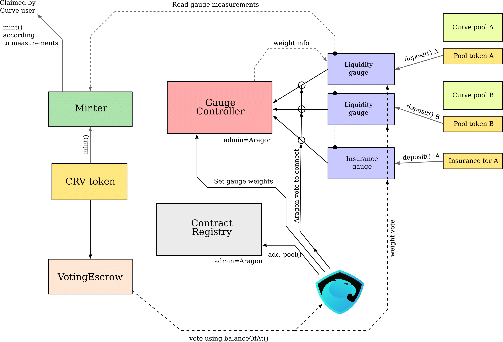
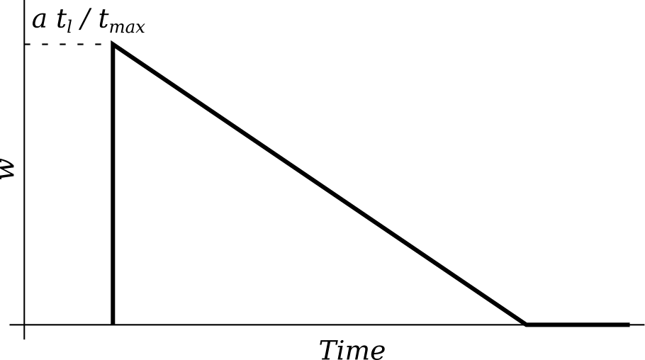

# Curve DAO

Curve DAO由Aragon连接的多个智能合约组成。除了之外，标准Aragon的1 token = 1投票方案被与锁定时间成比例的投票权重取代，如下所述。

Curve DAO具有CRV代币，可用于治理和增加价值。

## 时间加权投票.投票代币锁定

在Curve DAO中，不用token数量$a$投票,token可以在_VotingEscrow_中锁定一段可选的锁定时间$t_l$，其中$t_l < t_{\max}$,而 $t_{\max} = 4~\text{years}$. 锁定后，解锁时间是 $t\le t_l$.投票权重等于：$$w = a \frac{t}{t_{\max}}.$$.换句话说，投票既是数量又是时间加权的，其中时间的计算是指令牌将来锁定的时间。

帐户锁定的代币不能是智能合约（因为是可交易或可代币化），除非它是列入白名单的智能合约之一\(例如，广泛使用的多签名钱包)。

_VotingEscrow_ 类似于Aragon的Minime token。最重要的是，`balanceOf（）/ balanceOfAt（）`和`totalSupply（）/ totalSupplyAt（）`返回时间加权投票权重$w$以及所有这些权重的总和 $W = \sum w_i$。Aragon可以将_VotingEscrow_当作接口，就好像它是一个典型的治理token。

{width=280px}

可以使用`create_lock（）`创建锁，并使用`increase_unlock_time（）`延长时间。或带有`increase_amount（）`的令牌数量，以及`withdraw（）`当锁过期时，可以删除令牌。

### 实施细节

自锁定时刻起，用户投票权 $w_i$ 呈线性下降。总投票权 $W$ 也是如此。为了避免定期签入，每次用户存入，提取或更改锁定时间时，我们都会在`user_point_history`中记录线性函数 $w_i(t)$ 的用户斜率和bias_。我们还改变总投票权 $W(t)$ 的斜率和偏差，并记录在`point_history`中。另外，当用户的锁计划结束时，我们_schedule_改变斜率$W(t)$保存在`slope_changes`中。每次更改都会将`epoch` 增加1。

这样，我们不必遍历所有用户就可以知道应该多少$W(t)$更改，我们都不要求用户定期检查。然而，我们将用户锁定的结束时间限制在整周内。

当用户放置并锁定治理令牌时，坡度和偏差都会发生变化，以及锁定时间到期时。所有可能的到期时间均四舍五入为整周的时间来使区块链读取的次数与最多错失了几周，而不是用户数（可能会很大）。

## 通货膨胀时间表. ERC20CRV

代币 _ERC20CRV_ 是一种允许分段线性通货膨胀的ERC20代币。通货膨胀每年下降$2^{1/4}$。只有 _Minter_ 合约可以直接铸造 _ERC20CRV_，但只能在限制范围内定义通货膨胀。

每次通货膨胀发生变化，新的采矿时代就开始了。

{width=280px}

CRV的初始供应量为12.73亿美元的代币，占最终代币的$42\%$ ($t\rightarrow\infty$) 供应量$\approx 30.3$ 亿个代币。所有这些初始令牌都逐步归属（每个块都有）。支持上述通胀时间表的初始通胀率是 $r=22.0\%$（每年2.796亿美元）。所有的通货膨胀均分配给Curve用户，根据_gauges_进行的估算。在第一年，大约流入循环供应量为200万每天的CRV。

## 系统估算. 流动性估算和估算控制器

在Curve中，用户使用估算方案使用计算通货膨胀。目前只有 _LiquidityGauge_ 可以估算多少用户提供的流动性。可以使用相同类型的估算方案估算“流动性”。

为了使 _LiquidityGauge_ 衡量一段时间内的用户流动性，用户需要存入他的LP令牌可以使用`deposit（）`进入计算，并可以使用`withdraw（）`进行提取。

货币兑换率取决于当前的通货膨胀率和估算类型的权重(在Aragon中进行投票)。每个用户的通货膨胀率与他的LP代币锁定成比例。另外，如果用户_VotingEscrow_中的Curve进行vote-locks治理token，则最多可使奖励提高2.5倍。

用户 _不需要_ 定期检查。我们描述了这是如何进行的在技​​术细节上实现。

_GaugeController_ 保留一个估算方案及其类型的列表，每一个的权重规格和类型。

每个池都有估算方案(每个池都有一个单独的估算方案)。

### 流动性估算实现细节

假设我们的通货膨胀率$r$随每个周期（1年）变化，估算权重为$w_g$和估算类型权重为$w_t$。所有估算方案在每次$w_g$, $w_t$更新或挖矿次数改变时，以 $r^{\prime} = w_g w_t r$ 的系数处理通货膨胀流。

为了计算用户的$r^{\prime}$公平份额，我们基本上需要计算积分：$$I_u = \int \frac{r^{\prime}(t)\, b_u(t)}{S(t)}\,dt,$$ 其中$b_u(t)$ 是用户提供的余额（以LP令牌计量），并且$S(t)$ 是用户提供的总流动性，取决于时间$t$；$I_u$的值给出了必须给用户铸造的令牌数量。
每当用户$b_u$存款或取款时，用户$u$的余额都会更改，每次 _any_ 用户存款或取款时$S$都会更改(因此$S$
可以在用户$u$的两个事件之间更改多次)。在 _LiquidityGauge_ 合约中，$I_u$的值记录在每个用户的`integrate_fraction`map映射中。

为了避免所有用户定期checkpoint，我们会记录值以下整数（在合同中称为`integrate_inv_supply`）：$$I_{is}(t) = \int_0^{t} \frac{r^{\prime}(t)}{S(t)}dt.$$. $I_{is}$的值记录在任何用户存款或提款的任何时候，以及每当系数$r^{\prime}$发生变化时（由于权重或采矿周期变化）。

当用户存款或提款时，$I_u$ 的变化可以计算为当前值（在用户执行操作之前）$I_{is}$乘以预操作用户余额，用户余额合计 ：$$I_u(t_k) =\sum_k b_u(t_k) \left[I_{is}(t_k) - I_{is}(t_{k-1})\right].$$。每个用户的积分可以用这个和重新计算，因为$b_u(t)$ 在$t_{k-1}$ 和 $t_k$之间的始终保持不变。

为了激励用户参与治理，另外建立流动性粘性，我们执行以下机制。用户锁定增加了 _LiquidityGauge_ 中的用户余额 _VotingEscrow_ 中的CRV令牌，取决于其投票权重$w_i$：$$b_u^* = \min\left( 0.4\,b_u + 0.6\,S\frac{w_i}{W},\, b_u \right).$$。$w_i$的值是在用户执行任何操作（存款，撤回，撤回铸造的CRV令牌）并应用到下一个该用户执行的操作。

如果用户没有投票锁定任何CRV（或者根本没有投票），则通货膨胀将只是按比例分配流动性$b_u$。但是，如果用户锁定足够多的CRV，他就可以加速(最快2.5倍)生成自己的CRV（不这样做的用户稍微少一点）。

实现细节是在用户最后一个实质操作或 checkpoint 时。由于投票权随时间推移而减少，这对于vote-lock 很多token而不使用的用户是一种压力。一旦投票锁定过期，每个人都可以通过创建一个checkpoint来“剔除”该用户，重置已经没有投票权的用户。

最后，该估算方案应该不会错过整整一年的通货膨胀（例如整年都没有与指标进行交互）。如果有的话发生这种情况时，废弃的估算方案获得较少的CRV。

## 投票权重的估算

用户不仅可以在Aragon中为改变权重投票，也可以将他们的投票锁定token分配给一个或其它估算（池）。该池将获得与分配给它的投票锁定代币成比例的CRV代币。每个在VotingEscrow中具有token的用户都可以随时更改其偏好。

接下来的整个星期（出于可伸缩性的原因），用户想要申请新的投票权重时，同一个估算方案的投票权重10天内只允许更改一次。

### GaugeController的实现细节

为了实现权重投票，_GaugeController_ 必须包含处理每个用户拥有的投票权线性特征的参数。

与 _VotingEscrow_ 中的操作类似，_GaugeControlle _在vote_points中记录每个估算（偏置+斜率），_scheduled_ 在`vote_bias_changes`和`vote_slope_changes`中针对这些点的偏差和斜率变化，每周都会变化，并且在`vote_user_slopes`中记录每个用户当前的斜率，以及用户使用的power和他们vote-lock的结束的时间。

每个估算方案都有投票权重的slopes和biases总和，以及每种类型的总和，获得下一周的 scheduled / recorded，以及某些用户在锁定到期时投票权变为0时的数量。

当用户更改自己的首选时，不是立即改变权重，而是下一个星期。这样做是为了减少每个用户需要执行的区块链读取次数：与自上次更改以来的周数成正比，而不是其他用户进行的互动次数。

_GaugeController_ 是系统最核心的部件之一，因此它必须由DAO控制。不应该由一个集中的管理员控制它，不给任何人单方更改类型权重的权力。

## 费用销毁者

每个池都允许管理员使用`withdraw_admin_fees`收取费用。Aragon应该能够将这些费用收集到管理员帐户，并在自由市场上使用他们购买和销毁CRV。不需要表决就这样做。

除了销毁，在相同的接口上可能会有不同的工作机制.但是不会立即生效。

## 估算奖励交易量和投票治理

投票和交易都是离散事件，所以他们可以使用相同的估算方案。
这个想法是每个事件都有一个随时间呈指数衰减的权重。

每次用户在Aragon中投票时，都应该调用估算合约。